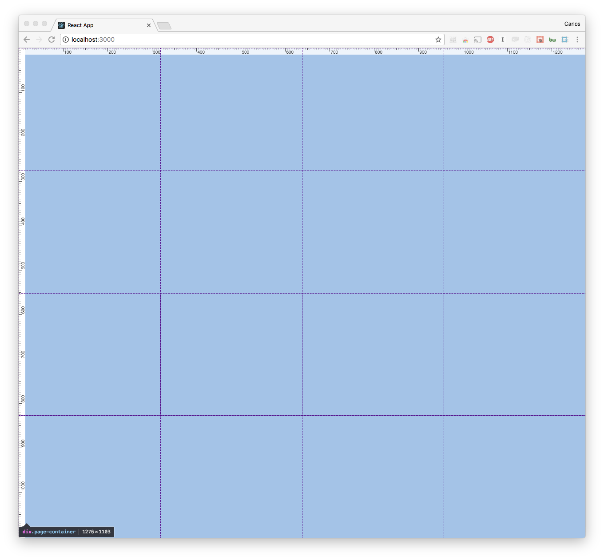
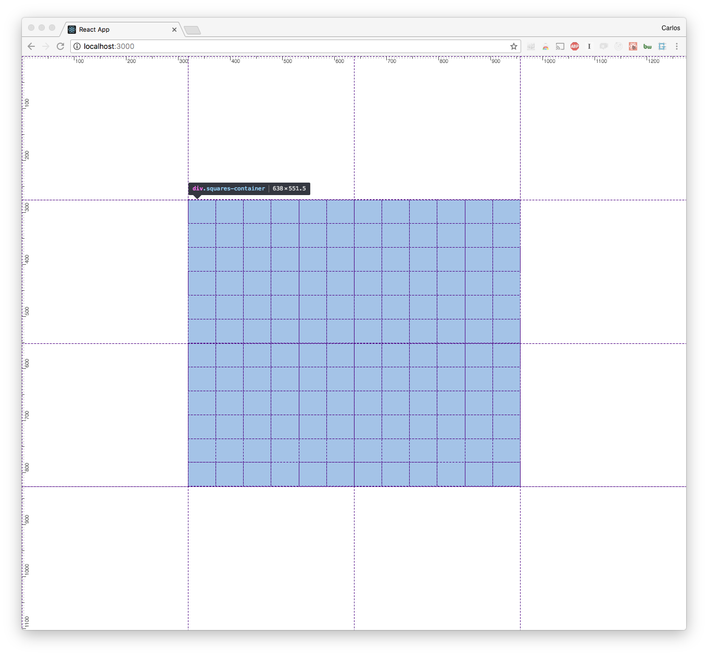
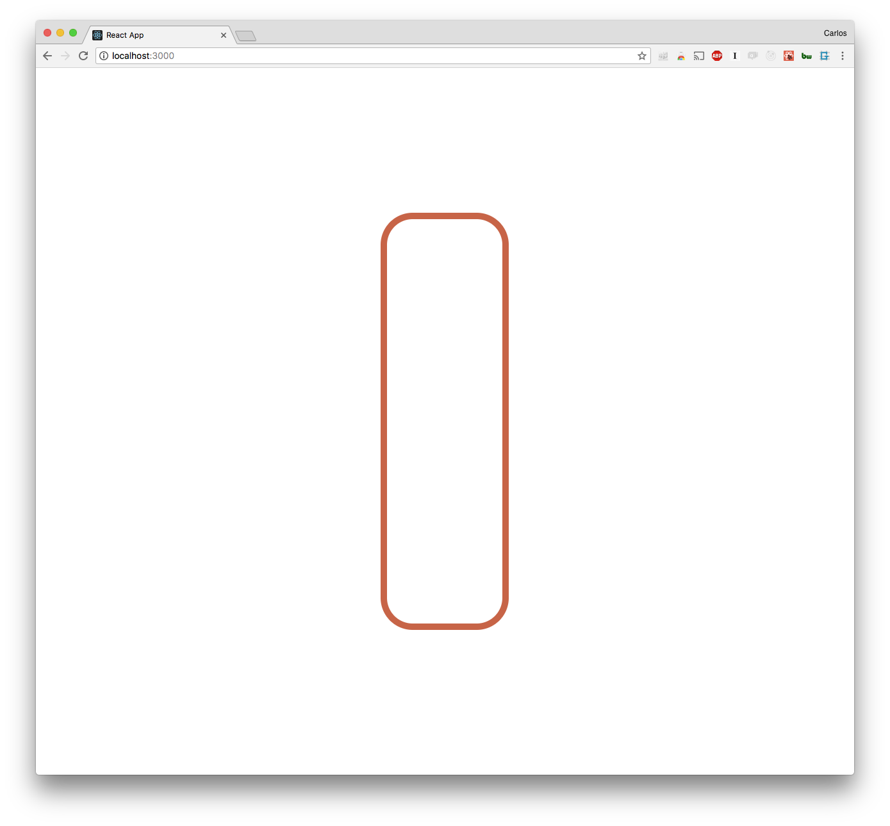
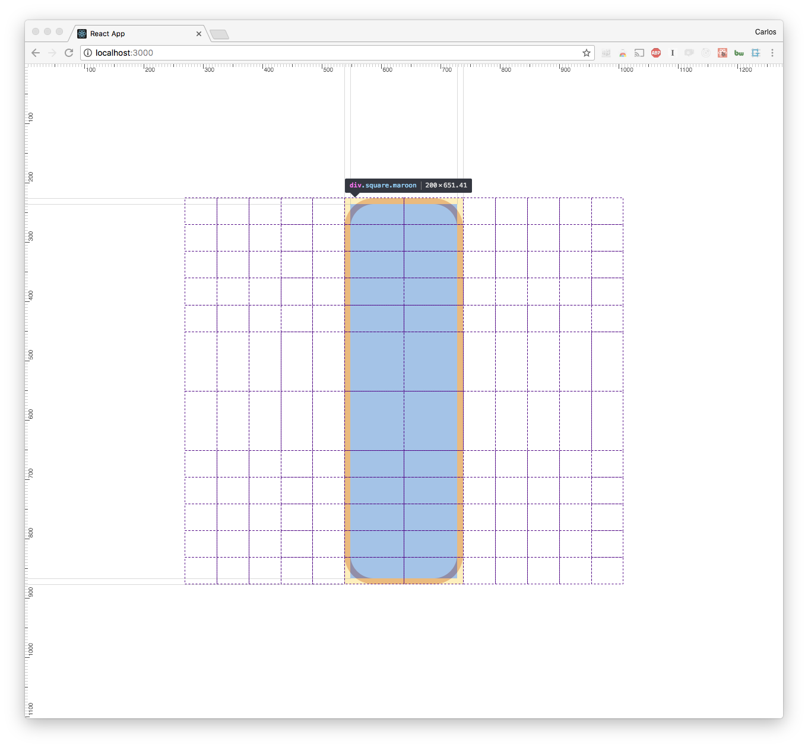
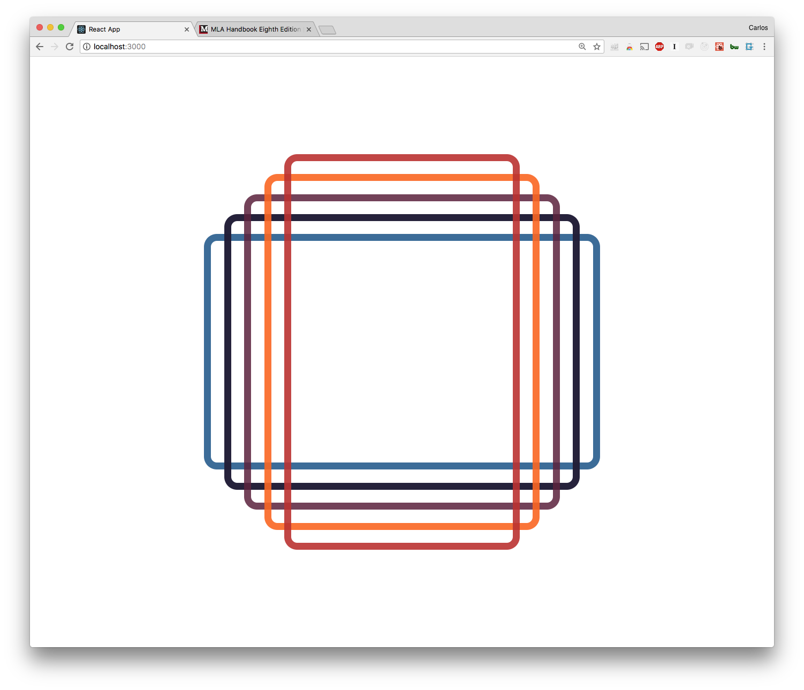
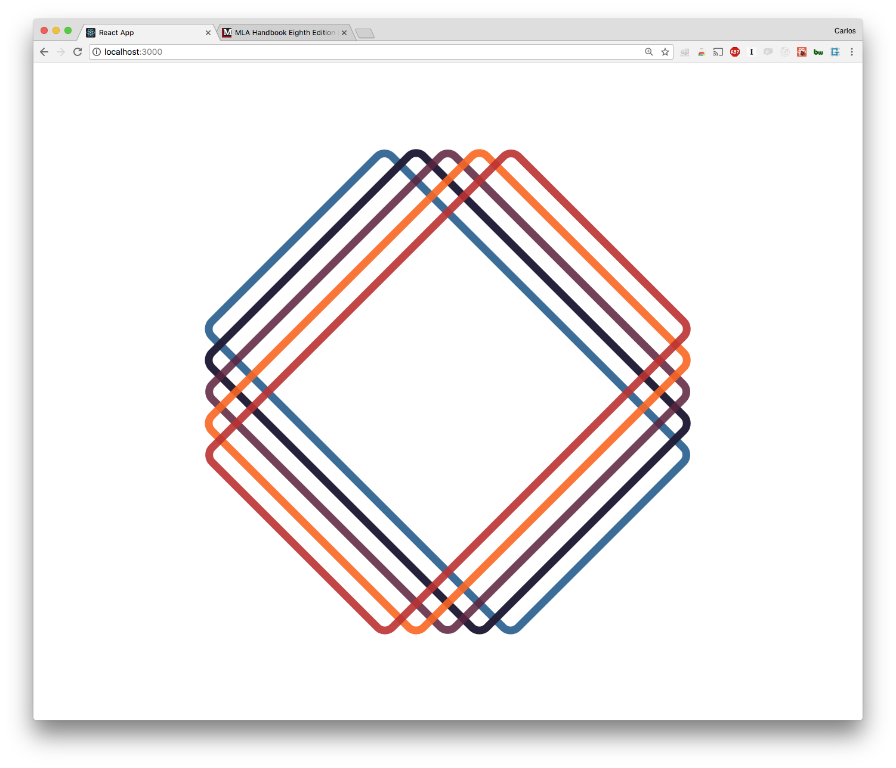

# Using CSS grid to build the MLA Handbook Eighth Edition Cover Design

My wife is taking an English Literature class this semester, and one of the required reference books is the eighth edition of the [MLA Handbook](https://www.mla.org/Publications/Bookstore/Nonseries/MLA-Handbook-Eighth-Edition). I was struck by the cover design of the book, and though this would be a great exercise in using grid to achieve a similar look.

I have already used grid to build the [grid-crawler browser game](https://cquinones100.github.io/grid-crawler/). The isometric design was achieved by building a standard grid of cells of equal dimensions and transforming the grid to look 3D.

The transformation to achieve this look will be a simple 45 degree rotation.

## The container

I am going to get started with building a container for the entire page in grid. I'm going to want to get this square image centered, so I am doing a 4 x 4 grid.

```css
.page-container {
  display: grid;
  grid-template-columns: auto auto auto auto;
  grid-template-rows: auto auto auto auto;
  height: 100%;
  width: 100%;
}
```

This gives a grid that looks something like this:


Our image is going to sit on column 2 row 2 and span 2 columns on each direction. I am building this out to have 10 columns and 10 rows. Here's the code:

```css
.squares-container {
  grid-row-start: 2;
  grid-row-end: span 2;
  grid-column-start: 2;
  grid-column-end: span 2;
  display: grid;
  grid-template-columns: auto auto auto auto auto auto auto auto auto auto;
  grid-template-rows: auto auto auto auto auto auto auto auto auto auto;
}
```

This will give us the following grid:


Notice there's a ton of repeated autos in both code snippets above. We can actually DRY up that code by adding in repeat(), for example:

```
  grid-template-columns: repeat(12, auto);
```

Alright, the inner and outer grids are done, now its time to start making some squares!

## Squares

The image we're looking for is made up of 5 overlapping squares of varying heights and widths. The outer most and inner most squares overlap, creating a perfect square in the center. We're going to have to adjust our inner grid to create this effect.

We can do that by specifying the sizes of the inner most cells of the grid.

I am going to set aside 4 columns at the top and bottom and 4 columns at the left and right for the square borders. That leaves us with 2 columns and 2 rows in the center. For now, I am going to explicitly specify the px width and height of each cell. We'll want to make some adjustments later to make the image responsive

```css
.squares-container {
  grid-row-start: 2;
  grid-row-end: span 2;
  grid-column-start: 2;
  grid-column-end: span 2;
  display: grid;
  grid-template-columns: repeat(4, 25px) repeat(2, 100px) repeat(4, 25px);
  grid-template-rows: repeat(4, 25px) repeat(2, 100px) repeat(4, 25px);
}
```

### The first square

I am going to start off with basic color matching to identify each square. I am going to start off with the 'maroon' square and work my way down.

First, i'll define a general square class that has the attributes for border width and radius:

```css
.square {
  border-radius: 50px;
  border-style: solid;
  border-width: 10px;
}
```

Then I'll have the first square span from the top row to the bottom row. It is also one of the two innermost squares, so I'll have its width span only to the ends of our wider center cells.

```css
.maroon {
  grid-row-start: 1;
  grid-row-end: span 10;
  grid-column-start: 5;
  grid-column-end: span 2;
  border-color: rgb(203, 100, 67);
}
```

I am using grid-row-start and grid-row-end to specify the start and beginning points vertically. Doing the same with column-row-start & column-row-end for horizontal axis. The `span` keyword tells css how far to extend the element from the start point.

This gives us the following result:


and with chrome's built in grid inspector:


Pretty cool! Now we can just repeat the process for the rest of the squares, adjusting the row-start / end, column-start / end and color accordingly.

And once the colors, opacities and z-indexes for each square are all adjusted, we have something like this:



Finally, we'll rotate the container by 45 degrees and achieve our desired result:


